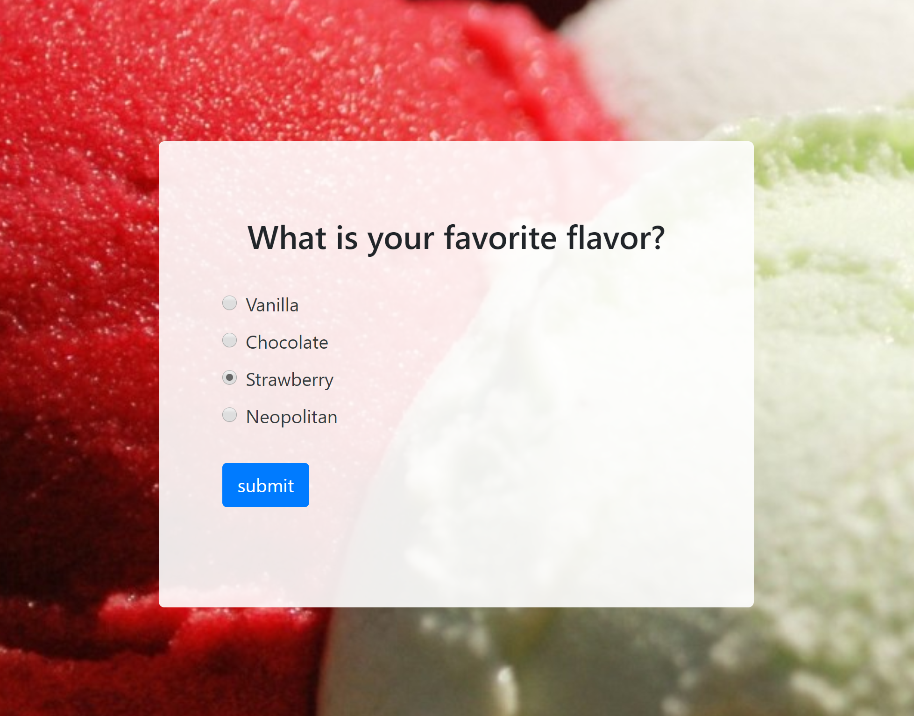

## Poll App - Full Stack

This application provides a frontend view for the poll, and backend logic to track votes persistently for users.

Customizable React poll application written with Reshuffle.

Keywords: javascript, react, create-react-app, fullstack, poll, survey, bootstrap, backend

Styling is mostly accomplished with [React Bootstrap 4](https://react-bootstrap.github.io/).

This project was bootstrapped with [Create React App](https://github.com/facebook/create-react-app).

## Screenshots

